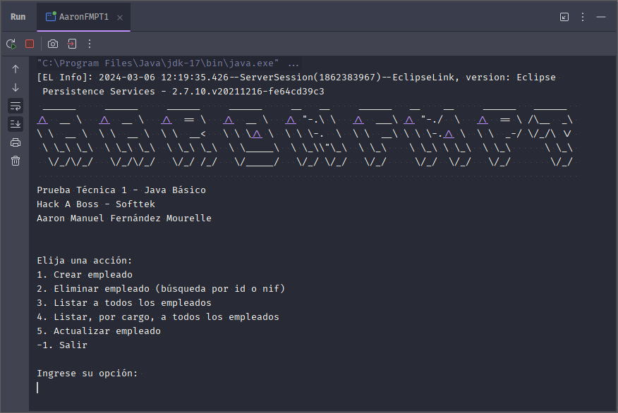

# PRUEBA TÉCNICA 1
Hack A Boss - Softtek

Aaron Manuel Fernández Mourelle

## DESCRIPCIÓN
Aplicación Java encargada de operaciones de gestión sobre una tabla Empleados de una base de datos MySQL.

## ⚙️FUNCIONALIDADES
### ➕ALTA
**Alta de empleados en lotes de 10 registros.**

Dicha funcionalidad se encargará de registrar nuevos empleados y considerará dos casos si el candidato ya existiera en la base de datos:
- Si el empleado ya existe y no está marcado como borrado, se informará al usuario de su existencia.
- Si el empleado ya existe pero está desactivado, se reactivará y actualizarán sus datos.

### ➖BAJA
**Borrado lógico de empleados.**

Los datos de los empleados no se eliminarán de la base de datos, sino que se realizará un borrado lógico (los empleados se marcarán como desactivados). Se podrá realizar el borrado lógico de empleados por dos criterios:
- Por ID.
- Por DNI/NIF.

### 🔀MODIFICACIÓN
Se podrá realizar la modificación de empleados por dos criterios:
- Por ID.
- Por DNI/NIF.

### 📑LISTADO
Se mostrará un listado de todos los empleados registrados y activos en la base de datos. Además, se podrá filtrar el listado por cargo.

## 📝USO
### Ejecución de la aplicación
#### 🔧Requisitos
- JDK 17 o superior.
- IDE que soporte Java.
- Apache Maven.
- Xampp, wamp, o cualquier otro gestor (incluído nativo) que de soporte a MySQL (puerto por defecto 3306).
- Base de datos de nombre `Empleados`.
- Ejecutar el script `empleados.sql` para crear la tabla `empleados` en la base de datos `Empleados`.

#### ⏯️Ejecución
Para lanzar la aplicación, clone este repositorio y abra el proyecto con su IDE preferido. Ejecute el archivo `AaronFMPT1.java`.

### Uso de la aplicación
La aplicación se presenta con este formato. Se solicitará al usuario que introduzca un número para seleccionar la opción deseada.

Durante los procesos de creación o modificación, se validarán los datos introducidos por el usuario. Si los datos no son válidos, se informará al usuario y se le solicitará que los introduzca de nuevo. Esta validación permite 3 intentos por registro. El usuario será informado de cuántos intentos le quedan.

En caso de que el usuario agote los intentos, se le informará y se le devolverá al menú principal.
En el caso del registro, los intentos se reestablecerán al iniciar un registro nuevo.

### 🔍Validación de datos
#### 📇DNI/NIF
El DNI/NIF se validará con formato básico, es decir, 8 dígitos y una letra. La letra podrá ser mayúscula o minúscula.
#### 👩‍💼Nombre, apellidos y cargo
Se validarán comprobando que no estén en blanco ni superen los 50 caracteres.
#### 📅Fecha de contratación
Seguirá el formato `dd/MM/yyyy` (p.ej. 16/12/1976) y se comprobará que sea una fecha válida.
#### 💰Salario
Se comprobará que sea un número positivo.

## 💭SUPUESTOS
- Búsquedas y listados:
    - Se supone que el usuario tiene acceso a la base de datos, pudiendo escoger un ID.
    - Se supone que la búsqueda por NIF sólo devolverá activos.
    - Se supone que la búsqueda por ID devolverá indiscriminadamente.
    - Los listados se realizarán únicamente a los empleados activos.
- Creación en lotes:
    - Se supone que el usuario puede estar interesado en continuar el proceso de creación.
        - Se supone que si el empleado existe y está desactivado, se reactivará y actualizarán sus datos.
        - Se supone que si el empleado existe y no está desactivado, se informará al usuario de su existencia.
    - Se supone que el usuario puede cambiar de idea y podrá cancelar el proceso de creación en cualquier punto con simplemente enviar un dato erróneo (un Enter vacío) 3 veces.
